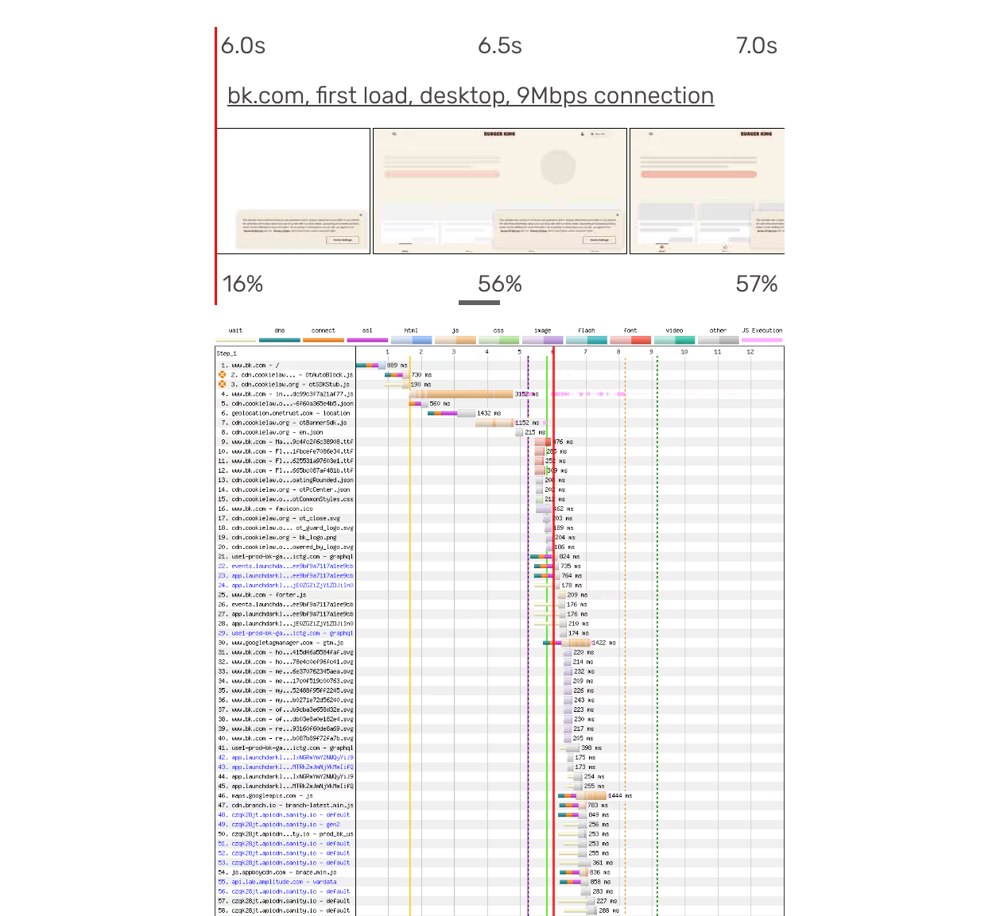
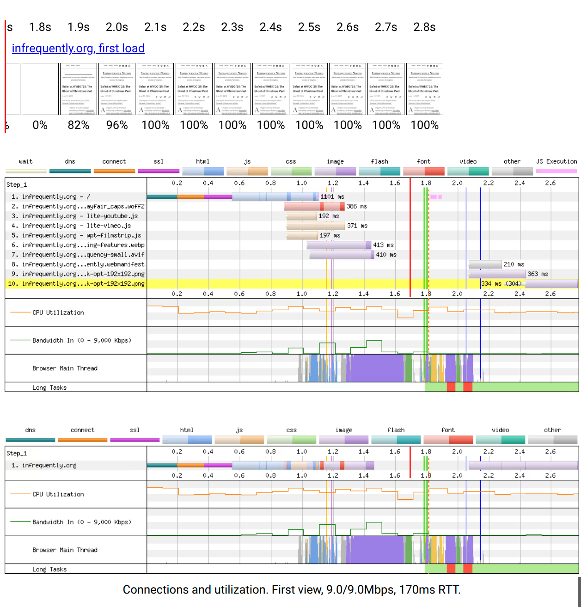
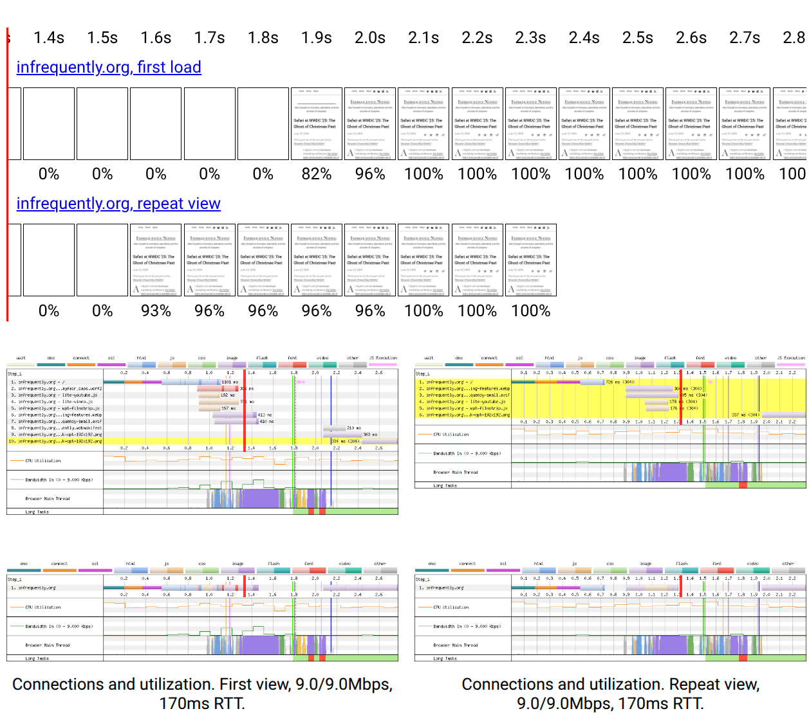
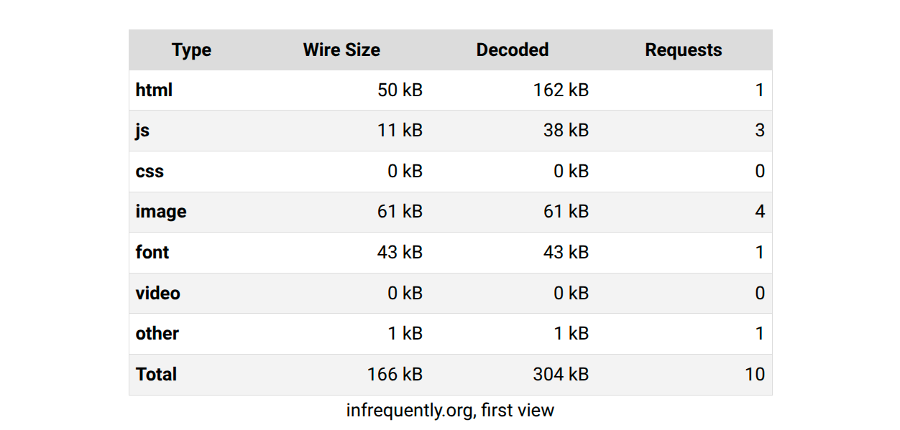
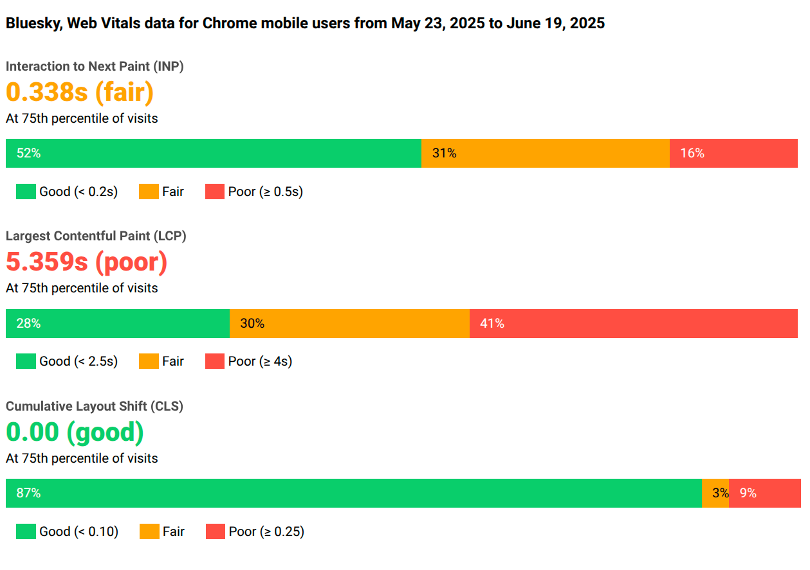

# wpt-embed

Scripts for downloading [WebPageTest.org][wpt] traces and Web Components for displaying them in your own pages.



<!-- TODO: link to demo -->

## The Problem

[WebPageTest.org][wpt] is the gold standard for repeatable, low-variance, automatable web performance testing. In addition to [its many killer features][wpt-docs], it leans on the web's superpower &mdash; links &mdash; to enable low-confusion joint investigations. But the downside of this SaaS model is that trace URLs don't live forever, and documenting the state of a site, perhaps for posterity, can involve fumbling through WPT artefacts to download and present them. The [official NPM module][wpt-npm-module] should be a solution to this problem, but as of mid-2025 it appears somewhat broken and _lightly_ maintained, shall we say.

To fill this gap for the author's own blogging purposes, this repository contains tools to download media and metadata about traces you run via WPT, and a small Web Component to display that data on your own site, thereby allowing you to copy all the resources and remove potential breakage due to the time-limited durability of WPT traces on the public server.

## How It Works

This is designed to be a lightweight setup with zero client-side dependencies. In short, you provide a [WPT API key][wpt-key] via environment variable, command line, or config file, and we fetch the results.

The result of those operations will be a `./wpt-traces/` directory with folders corresponding to each test, their individual runs, etc. Media assets, including videos and gifs of page load, will also be saved.

The `<wpt-embed>` web component consumes the `timeline.json` file generated in each trace run's directory, referencing the previously downloaded media, allowing you to capture WPT traces for posterity, without concern for trace retention on WPT.

## CLI Examples

First, install this package into your project via NPM, or via github (today):

```console
$ npm i --save @slightlyoff/wpt-embed
```

Then run the provided script to download a previously-captured WebPageTest.org trace using your API key and the test ID:

```console
$ pwd
/tmp/test
$ npx wpt-fetch --key [yourkey] TEST_ID:FRIENDLY_NAME
ℹ no ouput directory, creating: /tmp/test/wpt-traces
✔  Results downloaded for test TEST_ID
✔  Downloaded 76 filmstrip images for TEST_ID, run 1, firstView
✔  Downloaded videos of TEST_ID, run 1, firstView
✔  Downloaded gif of TEST_ID, run 1, firstView
...
✔  Downloaded videos of TEST_ID, run 3, firstView
✔  Downloaded 63 filmstrip images for TEST_ID, run 3, repeatView
✔  Downloaded videos of TEST_ID, run 3, repeatView
✔  Downloaded gif of TEST_ID, run 3, repeatView
✔  Downloaded videos of TEST_ID, run 3, repeatView
```

This will download the assets needed to render a WPT timeline into the output directory. If no directory is specified (via `-o <dir>` or `--out <dir>`), a new directory will be created under the current working directory at `./wpt-traces/`.

Within this directory, each run will be cached in a separate directory with its own, lightweight JSON summary that captures essential metrics and references to the media files needed to render the timeline.

Each directory has roughly the same structure:

```console
$ cd wpt-traces/
$ tree
.
└── FRIENDLY_NAME
    ├── results.json
    └── runs
        ├── 1
        │   ├── firstView
        │   │   ├── checklist.png
        │   │   ├── connectionView.png
        │   │   ├── filmstrip
        │   │   │   ├── ms_000000.jpg
        │   │   │   ├── ms_003500.jpg
        │   │   │   ├── ...
        │   │   │   └── ms_035000.jpg
        │   │   ├── screenShot.png
        │   │   ├── timeline.gif
        │   │   ├── timeline.json
        │   │   ├── timeline.mp4
        │   │   └── waterfall.png
        │   └── repeatView
        │       ├── ...
        │       ├── timeline.json
        │       ├── timeline.mp4
        │       └── waterfall.png
        ├── 2
        │   ├── firstView
        │   |   ├── ...
        │   |   ├── timeline.json
        │   |   ├── timeline.mp4
        │   |   └── waterfall.png
        │   └── repeatView
        │       ├── ...
        │       ├── timeline.json
        │       ├── timeline.mp4
        │       └── waterfall.png
        └── 3
            ├── firstView
            |   ├── ... 
            |   ├── timeline.json
            |   ├── timeline.mp4
            |   └── waterfall.png
            └── repeatView
                ├── ... # You get the idea
                ├── timeline.json
                ├── timeline.mp4
                └── waterfall.png
```

Each of the view directories includes media and a a`timeline.json` file. To display timelines, we use the components provided in this package.

> [!NOTE]
> In the `TEST_ID:FRIENDLY_NAME` invocation above, renaming is option. If the `:...` is omitted, the test ID will be used as the directory name instead.

## Component Examples

Let's build a test file inside the same directory in which we ran the `wpt-fetch` script:

```console
$ pwd
/tmp/test
$ touch timelines.html
```

In `timelines.html`, we will directly reference the component script, but for product, you'd be expected to copy or package it to a different location. The script is self-contained and designed to work (only) on modern browsers:

```html
<!DOCTYPE html>
<!-- timelines.html -->
<html>
  <head>
    <script type="module">
      import "./node_modules/wpt-embed/src/components/wpt-embed.js";
    </script>
  </head>
  <body>
    <!-- 
     Display the first view, one frame every 500ms
    -->
    <wpt-embed 
      size="medium" 
      interval="500ms">
      <wpt-test
        run="1"
        test="./wpt-traces/FRIENDLY_NAME/">
        <!-- Progressive enhancement -->
        <a 
          href="https://www.webpagetest.org/video/results.php?tests=TEST_ID"
          target="_new">Test name and description</a>
      </wpt-test>
    </wpt-embed>

    <!-- 
     First-view and repeat-view, side-by-side 
     with small images
    -->
    <wpt-embed 
      size="small"
      interval="100ms">
      <!-- 
        The fully qualified path to a run's `timeline.json` 
        can be provided to via the "timeline" attr... 
      --->
      <wpt-test
        label="First View"
        timeline="./wpt-traces/FRIENDLY_NAME/runs/1/firstView/timeline.json">
        <!-- fallback link -->
        <a 
          href="https://www.webpagetest.org/video/compare.php?tests=TEST_ID-r:1-c:0"
          target="_new">First view</a>
      </wpt-test>
      <!-- 
        ...or just the directory, using "test". 
        
        A "run" number can be used in case it is not 
        "1", and "first" or "repeat" can be specified 
        via the "view" attribute:
      -->
      <wpt-test
        label="Repeat View"
        run="1"
        view="repeat"
        test="./wpt-traces/FRIENDLY_NAME/">
        <!-- fallback progressive enhancement -->
        <a 
          href="https://www.webpagetest.org/video/compare.php?tests=TEST_ID-r:1-c:1"
          target="_new">Repeat view</a>
      </wpt-test>
      <!-- SxS -->
      <a 
        href="https://www.webpagetest.org/video/compare.php?tests=TEST_ID-r:1-c:0,TEST_ID-r:1-c:1"
        target="_new">side-by-side comparison</a>
    </wpt-embed>

    <!-- First views, 60fps large images -->
    <wpt-embed 
      size="large"
      interval="60fps">
      <wpt-test test="./wpt-traces/FRIENDLY_NAME/">
      </wpt-test>
      <wpt-test
        run="2"
        test="./wpt-traces/FRIENDLY_NAME/">
      </wpt-test>
      <wpt-test
        run="3"
        test="./wpt-traces/FRIENDLY_NAME/">
      </wpt-test>
    </wpt-embed>
  </body>
</html>
```

> [!TIP]
> Timeline images are fetched from locations relative to the `timeline.json` file, so if you copy or move files, be sure to include the `filmstrip/` directory located next to `timeline.json` for the run in question, along with all media files in the same directory.

`interval` supports several shorthand values. Valid aliases for each interval:

 - **16ms**: `16`, `16ms`, `60fps`
 - **100ms**: `100`, `100ms`, `0.1s`
 - **500ms**: `500`, `500ms`, `0.5s`
 - **1000ms**: `1000`, `1000ms`, `1s`
 - **5000ms**: `5000`, `5000ms`, `5s`

All tests are displayed at the same interval on the timeline.

> [!NOTE]
> Prior to version 0.2.11, the `<wpt-embed>` component was named `<wpt-filmstrip>`. Both names are now registered for compatibility. No user-accessible CSS configuration should need to change, but `::part()` based customizations will need to target whichever tag name you choose in your pages.

### Alternate Filmstrip End Marks

`<wpt-embed>` supports alternative endpoints in the filmstrip viewer via the `end` attribute:

  - `full`: the default, per WPT's "fully loaded" judgement
  - `visual`: visually complete
  - `onload`: when the `onload` event fires
  - `lcp`: time mark for [Largest Contentful Paint][lcp]
  - `fcp`: time mark for [First Contentful Paint][fcp]

These can be helpful in situations where `full` may represent background work that is not material to visual completeness; for example, Service Worker cache installation:

```html
<wpt-embed size="medium" interval="fcp">
  <!-- ... -->
</wpt-embed>
```

### Waterfall and Connections

As of version 0.2.11, `<wpt-embed>` supports display of many new WPT data attributes, including images of waterfalls and connection utilization. By default, these are rendered below the timeline (see `order` below to change).

To enable waterfalls and connections, ensure that you have run `wpt-fetch` to update each run's summary data, and add the `waterfall` or `connections` flags to your component:

```html
<wpt-embed waterfall="true" connections="true">
  <!-- ... -->
</wpt-embed>
```

Two new sections will be displayed below the timeline in this example. If multiple `<wpt-test>`s are provided, waterfalls and connections for all tests will be displayed side-by-side.





> [!TIP]
> When upgrading a `<wpt-embed>` project, it's always advised to re-run the `./src/scripts/wpt-fetch` command you used to fetch timelines initially (preferably with the `--optimize-images` and `--rebuild-timelines` flags), as the content of each run's JSON file is re-computed from the source trace JSON each time. 
> Support for new features requires that the subset computed for each run is updated. If you upgrade your component and new features such as waterfalls and connection views do not appear to work, double check that you have updated your traces.

In modern browsers, a red line will be displayed next to the timeline and on each waterfall or connection image. As the user scrolls the timeline, the red bar will "scrub" to the right, matching the location in time from the filmstrip to the waterfall views below. This UI will feel familiar to anyone who has used WPT's [powerful filmstrip view.][filmstrip-view]

> [!NOTE]
> Timeline scrubbing on scroll depends on browser support for [CSS `scroll-timeline`][scroll-timeline], which as of this writing has not landed in Safari or Firefox. Support is expected in late 2025, assuming Apple does not screw up the implementation. [A big "if".][showstoppers]

> [!IMPORTANT]
> Waterfall and connections views are incompatible with `end` values other than `full`, and warnings will be logged to the console if an incompatible combination is attempted.

### Disabling The Filmstrip

The filmstrip view is displayed for all tests by default. To show other views, but not the filmstrip, disable it by setting the `filmstrip` attribute to `false`:

```html
<wpt-embed 
  filmstrip="false"
  waterfall="true"
  connections="true">
  <!-- ... -->
</wpt-embed>
```

It is not currently possible to disable the filmstrip (or any other view) on a per-test basis.

### Content Breakdowns

To display tables that list the bytes and request counts for each mime type in a test run, use the `breakdown` attribute:

```html
<wpt-embed breakdown="true">
  <!-- ... -->
</wpt-embed>
```



### Core Web Vitals Reports

Summary CWV reports are also available for origins with enough traffic to qualify. They can be rendered using the `crux` attribute:

```html
<wpt-embed crux="true">
  <!-- ... -->
</wpt-embed>
```


### Gifs and Videos

WPT grabs video of page loading by default, and `wpt-fetch` attempts to download these assets. To embed them, use the `gif` and `video` attributes:

```html
<wpt-embed gif="true" video="true">
  <!-- ... -->
</wpt-embed>
```


### Reordering

The default vertical stack for WPT information in `<wpt-embed>` is:

  - `filmstrip`
  - `waterfall`
  - `connections`
  - `breakdown`
  - `crux`
  - `gif`
  - `video`

To specify a different order for rendering, provide a space-delimited list of sections via the `order` attribute:

```html
<wpt-embed size="medium" interval="500ms"
  waterfall="true"
  connections="true"
  gif="true"
  breakdown="true"
  order="gif breakdown filmstrip connections">
  <!-- ... -->
</wpt-embed>
```

Any sections selected but not listed will be placed last, in the usual order.

> [!NOTE]
> Post-load re-ordering via re-setting the `order` attribute or setter does not work as of 0.2.11.

## CSS API

User-configurable CSS variables and their default values:

```css
:root {
  --wpt-aspect-ratio: inherit;
  --wpt-section-padding: 1rem 0;
  --wpt-crux-good: rgb(12, 206, 107);
  --wpt-crux-fair: rgb(255, 164, 0);
  --wpt-crux-poor: rgb(255, 78, 66);
  --wpt-breakdown-even-color: inherit;
  --wpt-image-width: var(--image-width, 100px);
  --wpt-progress-line-color: red;
  --wpt-progress-line-width: 2px;
}
```

CSS `::part()`s are also provided to configure styling of each section. `::part()`s have the same names as in the `order` attribute and the section-enabling attributes; e.g.:

```css
wpt-embed::part(filmstrip) { /* ... */ }
wpt-embed::part(waterfall) { /* ... */ }
wpt-embed::part(connections) { /* ... */ }
wpt-embed::part(breakdown) { /* ... */ }
wpt-embed::part(crux) { /* ... */ }
wpt-embed::part(gif) { /* ... */ }
wpt-embed::part(video) { /* ... */ }
```

<!--
## DOM API

TODO
-->

## Performance Tips

Effort has been made to keep the web component lightweight, but as subresource are only fetched after script runs, the usual caveats apply with regards to CLS and ensuring that `wpt-embed.js` is loaded early and with the correct priority for your site.

### Generate Traces With `--optimize-images`

When the `--optimize-images` (a.k.a., `-opt`, a.k.a. env `WPT_OPTIMIZE=true`) flag is passed to `wpt-fetch`, AVIF-encoded copies of all images are (re)generated, and metadata is provided to allow `<wpt-embed>` to prefer those resources. On average, the AVIF versions are 30-50% smaller than PNG equivalents.

### Inline Test JSON

The `<wpt-test>` component supports inlining of timeline JSON, allowing you to skip a serialized fetch. To use this feature, include a single `<script type="text/json">` block as a child of a `<wpt-test>`, and copy the contents of the `timeline.json` file into it. 

In order to preserve relative URLs for image fetching, you'll also need to provide a separate `dir` attribute on that element:

```html
<wpt-embed breakdown="true">
  <wpt-test label="From inline'd data.">
    <script type="text/json" dir="../out/">
      {
        "id": "250624_ZiDcA4_2T7",
        "testName": "infrequently",
        "url": "https://infrequently.org/",
        "summary": "https://www.webpagetest.org/results.php?...",
        "testUrl": "https://infrequently.org/",
        "location": "IAD_US_01:Chrome",
        ...
      }
    </script>
  </wpt-test>
</wpt-embed>
```

### Use The `aspect-ratio` Attribute or Provide `--wpt-aspect-ratio`

To provide the component early information about the aspect ratio of filmstrip images, you can provide it before external configuration is loaded using the `aspect-ratio` attribute. This can be any value in [the format that CSS expects for aspect ratios.][a-r]

```html
<wpt-embed aspect-ratio="360 / 510">
  <!-- ... -->
</wpt-embed>
```

The same information can also be passed down using CSS custom properties:

```html
<wpt-embed style="--wpt-aspect-ratio: 360 / 510;">
  <!-- ... -->
</wpt-embed>
```

> [!NOTE]
> While varying aspect ratios between filmstrips are supported by the component at runtime, they are not supported in these attributes as of 0.2.11. For maximum performance with variant timeline configurations, consider inlining test data (see above).

## Design Goals

Client-side:

  - **Zero dependencies.** Components are small (~11kB gzipped, 36kB source) and self-contained for maximum performance.
  - **Single-connection serving.** Components and assets can all be delivered from the same server.
  - **DOM fidelity.** Components act like [big-boy HTML elements.][gold-standard]

`wpt-fetch`:

  - **Transparent recovery.** Re-running scripts should re-use previously downloaded assets to the greatest extent possible.
  - **File and environment based configuration** to avoid API key leakage.
  - **Full results available.** The `results.json` file deposited at the top of the test directory contains all the information WPT provides about a trace, and `timeline.json` subsets are produced from it.
  - **In-place upgrades.** Because `results.json` contains the full details of the test run, upgrades to support many new features only requires incremental re-generation of JSON for each test run.

## Future Directions

The current version is very much an MVP. Features that might get added (if there's demand):

For `<wpt-embed>`:

  - Overlapping image waterfalls w/ opacity
  - Long-task highlighting
  - More lifecycle moments in timelines and waterfalls
  - Better legends
  - Comparison breakdown tables
  - Breakdown mime type pie and bar charts
  - Problem highlighting in breakdowns (low gzip %, etc.)
  - Allow specifying *only* the `order` attribute to enable sections

For the fetch scripts and Node:

  - More reliable video fetching
  - Ability to generate and fetch side-by-side videos of multiple test runs.
  - An 11ty plugin for auto-fetching and embedding traces.
  - Expose fetching as a library.

[filmstrip-view]: https://nooshu.com/blog/2019/10/02/how-to-read-a-wpt-waterfall-chart/#how-the-filmstrip-view-and-waterfall-chart-are-related
[scroll-timeline]: https://caniuse.com/?search=scroll-timeline
[showstoppers]: https://webventures.rejh.nl/blog/2024/history-of-safari-show-stoppers/
[lcp]: https://web.dev/articles/lcp
[fcp]: https://web.dev/articles/fcp
[wpt]: https://www.webpagetest.org/
[wpt-key]: https://docs.webpagetest.org/api/keys/
[a-r]: https://developer.mozilla.org/en-US/docs/Web/CSS/aspect-ratio
[gold-standard]: https://github.com/webcomponents/gold-standard/wiki
[wpt-npm-module]: https://www.npmjs.com/package/webpagetest
[wpt-docs]: https://docs.webpagetest.org/